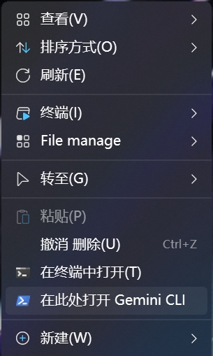

# rmc-aicli

在 Windows 右键菜单中一键打开 Gemini CLI 等AI命令行工具的傻瓜安装包。
————当您在任意文件夹空白处右键，添加一个快捷方式帮助您直接打开 PowerShell 并进入该目录运行如 `gemini` 的命令，助您直达AI命令行工具。

PS：搭配[Nilesoft Shell](https://nilesoft.org/)右键菜单增强工具疗效更好。

## 功能特性
- 在 Windows 文件夹空白处右键新增“在此处打开 Gemini CLI”。
- 自动检测本机 Node.js 版本，低于最低要求时自动下载安装。
- 以当前登录用户上下文安装 `@google/gemini-cli`，并确保 PATH 配置正确。

## 目录结构
- `GeminiCLI.iss`: Inno Setup 安装器脚本（自动安装 Node、安装 npm 包并注册右键菜单）。
- `RClick2Gemini.reg`: 注册表方案（方案 B），将“在此处打开 Gemini CLI”命令挂载到 Windows 右键菜单。
- `Output/`: 安装器构建输出目录（已在 `.gitignore` 中忽略）。

## 系统需求
- Windows 10/11，Inno Setup 安装器执行脚本生成的安装包以管理员身份运行安装。
- Node.js 最低版本：`20.0.0`（不足则自动下载安装 Node v22.20.0 x64）。
- 外网可访问 `nodejs.org` 与 npm registry（安装 `@google/gemini-cli` 需要）。

## 安装与使用
### 方式一：安装器（推荐）
1. 运行安装包 `Output/Gemini-CLI-Setup.exe`。
2. 安装器会检测 Node 版本，不足则自动下载安装；随后以原始用户上下文安装 `@google/gemini-cli`。
3. 完成后，在任意文件夹空白处右键，点击“在此处打开 Gemini CLI”，将打开 PowerShell 并进入该目录，执行 `gemini`。

### 方式二：注册表方案（替代）
1. 双击 `RClick2Gemini.reg` 导入注册表项。
2. 在文件夹空白处右键，点击“在此处打开 Gemini CLI”：该方案需要用户自己安装node.js环境，并依赖系统 PATH 中已可直接调用 `gemini`。

## 构建说明（开发者）
本项目实质为 Inno Setup 安装器脚本。
- 使用 Inno Setup（建议 6.x）打开 `GeminiCLI.iss`，编译后生成 `Output/Gemini-CLI-Setup.exe`。
- 若需离线安装 Node，可将 `node-v22.20.0-x64.msi` 与安装器放同一目录；下载失败时会自动回退为离线包。

## 常见问题 FAQ
- 重要：不同网络环境下，安装google/gemini-cli的速度可能存在差异，安装过程请给予足够多的等待时间。
- PowerShell 打开后提示找不到 `gemini`：
  - 执行 `npm -g ls @google/gemini-cli` 检查是否已安装；
  - 确认 `%APPDATA%\npm` 与 `C:\Program Files\nodejs` 写入了当前用户 PATH；
  - 重新登录或广播环境变量变化后再试。
- Node 下载失败：
  - 检查网络或将 `node-v22.20.0-x64.msi` 与安装器置于同目录后重试。
